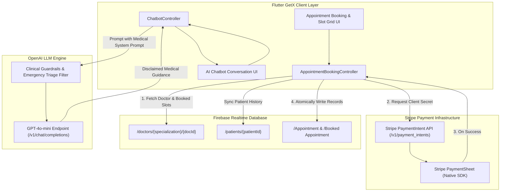
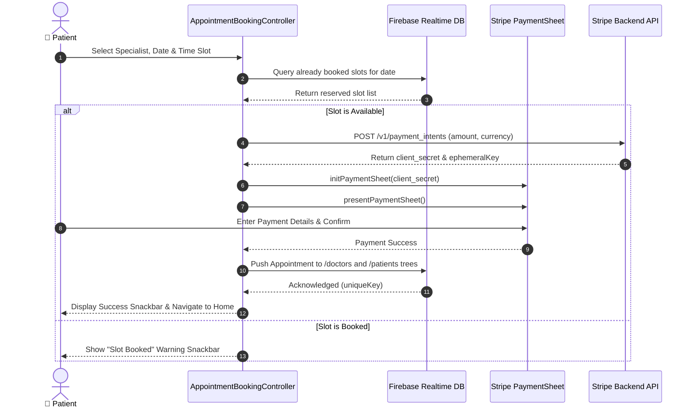

# 🏥 MediCare — Telehealth, Doctor Appointments & AI Medical Companion

[](https://flutter.dev)
[](https://dart.dev)
[](https://pub.dev/packages/get)
[](https://platform.openai.com/)
[](https://stripe.com/)
[](https://firebase.google.com/)
[](LICENSE)

> **MediCare** is an all-in-one mobile telehealth platform connecting patients to verified medical specialists with automated calendar slot booking, in-app Stripe payment processing, and an intelligent OpenAI-powered clinical guidance assistant.

---

## 📖 Overview

Access to timely medical consultations and reliable primary triage is essential in modern digital healthcare. **MediCare** unifies digital clinic appointments with conversational AI triage into a reactive, high-performance Flutter mobile application.

Built on the **GetX reactive architecture**, MediCare enables patients to browse medical specialists across disciplines, inspect availability across dynamic 20-minute time intervals, and confirm reservations via native **Stripe PaymentSheet** checkout. For preliminary medical questions, an integrated **OpenAI GPT-4o-mini health assistant** delivers safe, disclaimer-governed health information with automatic emergency redirection.

---

## 🏗️ Architecture & Interaction Flow



### Appointment Booking & Payment Sequence



---

## ✨ Core Features

- 📅 **Interactive Calendar & Slot Booking**: Rolling 7-day calendar picker paired with automated 20-minute slot matrix (09:00 AM – 03:20 PM) and real-time conflict prevention.
- 💳 **Seamless In-App Stripe Payments**: Native `flutter_stripe` integration supporting `PaymentSheet` modal checkouts with full transaction confirmation.
- 🤖 **AI Medical Companion (GPT-4o-mini)**: Context-aware AI chatbot programmed with strict clinical guardrails, automated disclaimers, and emergency escalation advisories.
- 🔄 **Bidirectional Firebase Synchronization**: Synchronous dual-record creation under both doctor and patient trees for comprehensive consultation history.
- ⚡ **Reactive State Management with GetX**: Ultra-fast UI state mutations, snackbar management, and memory-efficient dependency injection.
- 🩺 **Specialization Taxonomy**: Multi-tier directory categorized by medical specialties with doctor bios, contact data, and consultation rates.

---

## 📱 Key Screens & Modules

| Module / Controller | Primary Responsibility | Technical Details |
|---|---|---|
| **`AppointmentBookingController`** | Doctor details, date/slot matrix, and payment workflow | Queries Firebase `doctors` & `patients` refs, validates slot availability, coordinates Stripe PaymentSheet |
| **`ChatbotController`** | Conversational health triage & OpenAI integration | Implements exponential backoff retry loops, temperature control (0.3), token throttling, and clinical safety system prompts |
| **`AppointmentBookingScreen`** | User date & slot picker interface | Displays horizontal calendar chips, responsive slot grid with dynamic booking status states |
| **`ChatbotScreen`** | Conversational medical chat interface | Reverse-scrolling message list with custom user and assistant speech bubbles and typing indicators |

---

## 🛠️ Technology Stack

| Component / Layer | Technology | Version | Purpose |
|---|---|---|---|
| **Framework** | Flutter | `>=3.0.0` | Cross-platform mobile UI development |
| **Language** | Dart | `>=3.0.0` | Sound null-safety application code |
| **State Management** | `get` (GetX) | `^4.6.6` | Reactive controller binding, routing & snackbars |
| **Payments** | `flutter_stripe` | `^10.1.1` | Native mobile Stripe PaymentSheet integration |
| **AI LLM** | OpenAI REST API (`gpt-4o-mini`) | `v1` | Medical conversational triage and guidance |
| **Cloud Database** | `firebase_database` | `^11.0.0` | Real-time JSON tree doctor and patient storage |
| **HTTP Client** | `http` | `^1.2.0` | REST API communication for Stripe and OpenAI |
| **Date & Time** | `intl` | `^0.19.0` | ISO date formatting and time-slot serialization |

---

## 🚀 Getting Started

### Prerequisites

- **Flutter SDK (3.0.0+)** installed and configured.
- **Android Studio / Xcode** for mobile builds.
- A **Stripe Account** with Publishable and Secret API keys.
- An **OpenAI API Key** with access to `gpt-4o-mini`.
- A **Firebase Realtime Database** instance.

### Configuration

1. **Stripe API Setup**:
   Configure your publishable key in `AppointmentBookingController`:
   ```dart
   Stripe.publishableKey = "pk_test_YOUR_STRIPE_PUBLISHABLE_KEY";
   ```
2. **OpenAI API Setup**:
   Add your OpenAI API key in `ChatbotController` (or bind via secure environment configuration):
   ```dart
   final apiKey = "sk-YOUR_OPENAI_API_KEY";
   ```
3. **Firebase Configuration**:
   Ensure `google-services.json` (Android) and `GoogleService-Info.plist` (iOS) are placed in their respective platform directories.

### Build & Run

```bash
# Clone the repository
git clone https://github.com/shayann07/medicare_app_flutter.git
cd medicare_app_flutter

# Install Flutter dependencies
flutter pub get

# Run on an emulator or connected device
flutter run
```

---

## 📄 License

This project is licensed under the [MIT License](LICENSE) — Copyright (c) 2026 [shayann07](https://github.com/shayann07).
